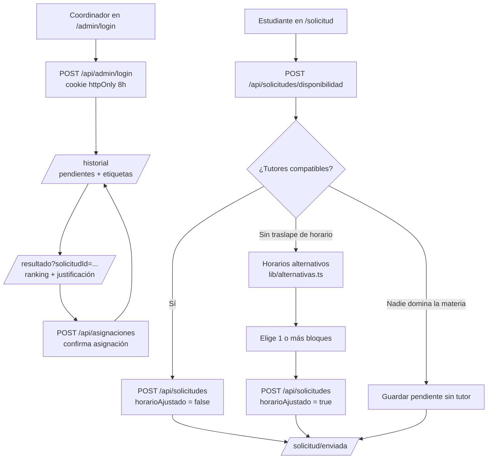

# TutorMatch

**Matching automático de tutores para cada estudiante.**

Un programa de tutorías entre pares asignaba tutores a mano: el coordinador revisaba quién estaba disponible, en qué materias era bueno y en qué horarios podía. TutorMatch automatiza eso: el estudiante indica materia, disponibilidad y preferencias; un algoritmo ponderado calcula un score de compatibilidad (0–100) contra cada tutor y recomienda al más compatible, con justificación en lenguaje natural y ranking de alternativas. El coordinador revisa el matching y confirma la asignación.

- **Para quién:** coordinadores de programas de tutoría y estudiantes que solicitan ayuda.
- **Roles:** estudiante (público) y coordinador (protegido con PIN).
- **Extras:** horarios alternativos automáticos cuando no hay tutores en el horario pedido.

---

## Demo

Las capturas se alojan en `docs/screenshots/` (carpeta por crear al preparar la presentación). Qué mostrar en cada una:

| Archivo sugerido | Qué debe verse |
| --- | --- |
| `01-inicio.png` | Página `/` con las tarjetas "Soy estudiante" y "Soy coordinador". |
| `02-solicitud.png` | Formulario en `/solicitud` con sugerencias de materias (datalist). |
| `03-alternativas.png` | Pantalla de horarios alternativos (ej. Cálculo un sábado). |
| `04-enviada.png` | Confirmación en `/solicitud/enviada`. |
| `05-login.png` | Login de coordinador en `/admin/login`. |
| `06-historial.png` | `/historial` con solicitudes pendientes, contador y etiquetas. |
| `07-resultado.png` | `/resultado?solicitudId=...` con tutor recomendado, barra de score, justificación y ranking con desglose. |

---

## Características

- **Matching ponderado** (lib/matching.ts → `calcularRanking`): horario, experiencia, preferencias y balanceo de carga.
- **Dos roles:** estudiante público y coordinador protegido con PIN (middleware.ts).
- **Horarios alternativos** (lib/alternativas.ts → `calcularAlternativas`): sugiere los bloques libres más cercanos sin revelar nombres de tutores.
- **Justificación automática** (lib/matching.ts → `construirJustificacion`) en lenguaje natural.
- **Historial** de asignaciones y solicitudes pendientes con etiquetas visibles ("Horario ajustado", "Sin tutor compatible").
- **Persistencia simple** en archivo JSON con datos de ejemplo precargados (8 tutores, 4 solicitudes, 2 asignaciones).

---

## Stack y requisitos

| Tecnología | Versión |
| --- | --- |
| Next.js (App Router) | ^14.2.15 |
| React | ^18.3.1 |
| TypeScript | ^5.4.5 (modo `strict`) |
| Tailwind CSS | ^3.4.4 |
| Node.js | ≥ 18.17 (probado con Node 22) |

**Variables de entorno** (ver `.env.example`):

| Variable | Descripción |
| --- | --- |
| `ADMIN_PIN` | PIN del coordinador. Si no se define, se usa `admin123` (lib/constantes.ts → `PIN_ADMIN_POR_DEFECTO`). |

> ⚠️ `admin123` es un **PIN de demostración**. Para cambiarlo, copia `.env.example` a `.env.local` y escribe tu PIN:
> ```
> ADMIN_PIN=mi-pin-secreto
> ```

---

## Instalación y uso

```bash
git clone https://github.com/TU_USUARIO/tutormatch.git
cd tutormatch
npm install
cp .env.example .env.local     # opcional; sin esto el PIN es admin123
npm run dev                     # http://localhost:3000
```

**Producción:**

```bash
npm run build
npm start
```

**Datos de ejemplo:** se cargan solos. Al arrancar, lib/db.ts → `leerDB` detecta que `data/db.json` no existe y lo crea con el seed de lib/seed.ts → `crearSeed` (8 tutores, 4 solicitudes, 2 asignaciones). Para restablecerlos en cualquier momento: botón **"Restablecer datos"** en `/historial` (llama a `POST /api/seed`).

---

## Roles y flujo de uso

**Estudiante (público):**
1. Entra a `/` y elige **"Soy estudiante"** → `/solicitud`.
2. Llena materia (con sugerencias), disponibilidad y preferencias.
3. Al enviar, la app consulta `POST /api/solicitudes/disponibilidad` **antes de guardar**:
   - **Hay tutores compatibles** → se guarda la solicitud y redirige a `/solicitud/enviada` ("¡Solicitud enviada! El coordinador revisará tu solicitud…").
   - **Hay tutores para la materia, pero no en ese horario** → muestra tarjetas seleccionables de horarios alternativos; al confirmar, la solicitud se guarda marcada como **"Horario ajustado"**.
   - **Nadie domina la materia** → mensaje "Por ahora no tenemos tutores para esta materia" y opción de guardar la solicitud pendiente sin tutor.

**Coordinador (protegido con PIN):**
1. Entra a `/admin/login`, ingresa el PIN (`admin123` por defecto).
2. Ve `/historial`: solicitudes pendientes destacadas con contador y etiquetas, e historial de asignaciones.
3. Abre una pendiente con **"Ver matching"** → `/resultado?solicitudId=...`: tutor recomendado, score con barra, justificación, ranking de alternativas con desglose por criterio.
4. Pulsa **"Confirmar asignación"** → la asignación queda en el historial.



---

## Estructura de carpetas

```
tutormatch/
├── middleware.ts                 # Protección de páginas y APIs por rol
├── next.config.mjs
├── package.json
├── postcss.config.js
├── tailwind.config.ts
├── tsconfig.json
├── .env.example
├── .gitignore
├── app/
│   ├── layout.tsx                # Layout global + Navbar
│   ├── page.tsx                  # Inicio: tarjetas "Soy estudiante" / "Soy coordinador"
│   ├── globals.css               # Clases .btn, .btn-secondary, .input, .label, .card
│   ├── admin/login/page.tsx      # Login del coordinador
│   ├── solicitud/
│   │   ├── page.tsx              # Formulario + 3 vistas (formulario / alternativas / sin tutores)
│   │   └── enviada/page.tsx      # Confirmación "¡Solicitud enviada!"
│   ├── resultado/page.tsx        # Vista del matching (coordinador)
│   ├── tutores/page.tsx          # Registro y administración de tutores
│   ├── historial/page.tsx        # Pendientes (con contador y etiquetas) + asignaciones
│   └── api/
│       ├── admin/login/route.ts      # POST login / DELETE logout
│       ├── asignaciones/route.ts     # GET historial / POST confirmar asignación
│       ├── match/route.ts            # GET match por solicitud / POST evaluación en vivo
│       ├── seed/route.ts             # POST restablecer datos de ejemplo
│       ├── solicitudes/
│       │   ├── route.ts              # GET lista / POST crear solicitud
│       │   └── disponibilidad/route.ts # POST verificar disponibilidad (público)
│       └── tutores/
│           ├── route.ts              # GET tutores / POST crear tutor
│           └── [id]/route.ts         # DELETE tutor
├── components/
│   ├── BloqueHorarioForm.tsx     # Editor de bloques día/hora reutilizable
│   ├── LoginForm.tsx             # Formulario de PIN
│   ├── Navbar.tsx                # Navegación según rol
│   ├── ResultadoContent.tsx      # Lógica y UI del resultado del matching
│   └── ScoreBar.tsx              # Barra de puntaje 0-100
├── lib/
│   ├── alternativas.ts           # calcularAlternativas (función pura)
│   ├── constantes.ts             # COOKIE_ADMIN, PIN_ADMIN_POR_DEFECTO
│   ├── db.ts                     # leerDB / guardarDB (persistencia JSON)
│   ├── matching.ts               # Algoritmo de scoring (funciones puras)
│   ├── seed.ts                   # crearSeed (datos de ejemplo)
│   └── types.ts                  # Todos los tipos de datos
└── data/db.json                  # Generado en runtime (ignorado por Git)
```

---

## Modelo de datos

Todos los tipos viven en `lib/types.ts`. La "base de datos" es un objeto `DB` (`{ tutores, solicitudes, asignaciones }`) serializado en `data/db.json`.

| Tipo | Campos | Relación |
| --- | --- | --- |
| `DiaSemana` | `'Lunes' \| 'Martes' \| 'Miércoles' \| 'Jueves' \| 'Viernes' \| 'Sábado'` (y constante `DIAS_SEMANA`) | Usado por `BloqueHorario` y `AlternativaHorario` |
| `Modalidad` | `'presencial' \| 'virtual' \| 'ambos'` | Tutor y preferencias |
| `NivelExperiencia` | `'junior' \| 'intermedio' \| 'avanzado' \| 'experto'` | Tutor |
| `BloqueHorario` | `dia: DiaSemana`, `inicio: number` (0–23), `fin: number` | Bloques de Tutor y de Solicitud |
| `Tutor` | `id`, `nombre`, `materias: string[]`, `bloques: BloqueHorario[]`, `aniosExperiencia`, `nivel`, `modalidad` | Puede tener muchas `Asignacion` |
| `PreferenciasEstudiante` | `modalidad: Modalidad \| 'cualquiera'`, `prefiereExperto: boolean` | Pertenece a `Solicitud` |
| `Solicitud` | `id`, `estudiante`, `materia`, `bloques`, `preferencias`, `creadaEn`, `asignacionId: string \| null`, `horarioAjustado?: boolean` | 0 o 1 `Asignacion` |
| `DesgloseScore` | `horario`, `experiencia`, `preferencias`, `carga` (cada uno 0–100) | Desglose de `ResultadoMatch` |
| `ResultadoMatch` | `tutorId`, `tutorNombre`, `scoreTotal`, `desglose`, `traslapeHoras`, `traslapeBloques`, `asignacionesActivas` | Fila del ranking |
| `MatchResultado` | `ranking: ResultadoMatch[]`, `recomendado`, `justificacion`, `motivoRechazo` | Respuesta del matching |
| `Asignacion` | `id`, `solicitudId`, `tutorId`, `estudiante`, `materia`, `tutorNombre`, `score`, `creadaEn` | Une `Solicitud` con `Tutor` (guarda snapshot de nombres) |
| `AlternativaHorario` | `dia`, `inicio`, `fin`, `modalidad` | Sugerencia al estudiante (sin nombre de tutor) |
| `DisponibilidadRespuesta` | `disponible: boolean`, `motivo?: 'sin-materia' \| 'sin-horario'`, `alternativas: AlternativaHorario[]` | Respuesta de `/api/solicitudes/disponibilidad` |

---

## El algoritmo de matching

Código: `lib/matching.ts` (funciones puras, sin dependencias de servidor).

**Descartes obligatorios (filtros, no puntúan):**
1. **Materia:** el tutor debe dominar la materia exacta (comparación insensible a mayúsculas; ver nota de acentos en "Auditoría").
2. **Horario:** debe haber al menos 1 hora de traslape (`calcularSolapaje`).

**Criterios ponderados** (pesos en `WEIGHTS`, ajustables en `lib/matching.ts`):

| Criterio | Peso | Fórmula (0–100) | Función |
| --- | --- | --- | --- |
| Horario | 35% | `min(100, traslapeHoras / horasTotalesEstudiante × 100)` | `calcularRanking` |
| Experiencia | 25% | `min(100, anios / 5 × 100)` (lineal; 5+ años = 100) | `scoreExperiencia` |
| Preferencias | 20% | Promedio del cumplimiento de cada preferencia activa: modalidad (100/0) y preferencia por experto (100 si ≥ 3 años). Sin preferencias = 100 (neutral) | `scorePreferencias` |
| Balance de carga | 20% | `100 − min(1, asignacionesActivas / 5) × 100` | `scoreCarga` |

**Score total:** `(35·horario + 25·experiencia + 20·preferencias + 20·carga) / 100`, redondeado.

**Ejemplo numérico resuelto** (datos reales del seed, `lib/seed.ts`):
Solicitud de *Lucía Fernández* (s-1): **Cálculo**, Miércoles 15:00–18:00 y Jueves 15:00–18:00 (6 h en total), modalidad *cualquiera*, prefiere experto.

| Tutor | Horario | Experiencia | Preferencias | Carga | **Total** |
| --- | --- | --- | --- | --- | --- |
| Ana Torres (t-ana) | 3 h de traslape (Mié 15–18) → 50 | 6 años → 100 | ≥ 3 años → 100 | 1 asignación → 80 | **(1750+2500+2000+1600)/100 = 78.5 → 79** |
| Javier Ortiz (t-javier) | 3 h (Jue 15–18) → 50 | 4 años → 80 | ≥ 3 años → 100 | 0 → 100 | (1750+2000+2000+2000)/100 = 77.5 → **78** |
| Luis Gómez (t-luis) | 3 h (Jue 15–18) → 50 | 2 años → 40 | 2/3 años → 67 | 0 → 100 | (1750+1000+1340+2000)/100 = 60.9 → **61** |
| Carlos Mendoza (t-carlos) | domina Cálculo pero sus bloques (Mar/Jue 8–11, Lun 16–19) no traslapan → **descartado** | — | — | — | — |

**Empates:** el ordenamiento en `calcularRanking` desempata por mayor score de experiencia, luego menor carga, luego nombre alfabético; si el empate persiste entre el 1.º y 2.º, la justificación lo anuncia ("Empate técnico con…").

**Justificación automática:** `construirJustificacion` arma una frase con materia, años y nivel de experiencia, bloques y horas de traslape, cumplimiento de modalidad y carga actual. Ej.: *"Se seleccionó a Ana Torres porque domina Cálculo, tiene 6 año(s) de experiencia (nivel experta), coincide contigo en 1 bloque(s) (3 h de traslape), cumple tu preferencia de modalidad cualquiera…"*.

**Horarios alternativos** (`lib/alternativas.ts` → `calcularAlternativas`, función pura): toma los bloques de los tutores que dominan la materia, excluye los que ya traslapan, elimina duplicados (mismo día + rango, fusionando modalidades), ordena por cercanía al horario pedido —**primero el mismo día en otro rango de horas, luego los días siguientes más próximos** (distancia cíclica hacia adelante sobre `DIAS_SEMANA`) y luego por distancia en horas—, y limita a **6 opciones** (`MAX_ALTERNATIVAS`).

**Dónde ajustar todo:** constantes `WEIGHTS` y `CONFIG` en `lib/matching.ts`; `MAX_ALTERNATIVAS` en `lib/alternativas.ts`.

---

## API

Protección aplicada por `middleware.ts`. "Pública" = sin sesión de coordinador.

| Método | Ruta | Recibe | Devuelve | Acceso |
| --- | --- | --- | --- | --- |
| `POST` | `/api/solicitudes` | `{ estudiante, materia, bloques, preferencias, horarioAjustado }` | `201` con la `Solicitud` creada (validación 400) | Pública |
| `GET` | `/api/solicitudes` | — | Lista de solicitudes | Protegida |
| `POST` | `/api/solicitudes/disponibilidad` | `{ materia, bloques }` | `{ disponible, motivo?, alternativas }` | Pública |
| `GET` | `/api/tutores` | — | Sin sesión: `{ materias: string[] }` (sugerencias). Con sesión: array completo de tutores con `asignacionesActivas` | Pública (vista reducida) |
| `POST` | `/api/tutores` | `{ nombre, materias, bloques, aniosExperiencia, nivel, modalidad }` | `201` con el `Tutor` (validación 400) | Protegida |
| `DELETE` | `/api/tutores/[id]` | — | `{ ok: true }` (404 si no existe) | Protegida |
| `GET` | `/api/match?solicitudId=...` | — | `{ solicitud, match, tutor, asignacion }` (404 si no existe) | Protegida |
| `POST` | `/api/match` | `{ materia, bloques, preferencias? }` | `{ match }` (evaluación en vivo, sin guardar) | Protegida |
| `GET` | `/api/asignaciones` | — | Historial de asignaciones (más recientes primero) | Protegida |
| `POST` | `/api/asignaciones` | `{ solicitudId, tutorId }` | `201` con la `Asignacion`. `409` si la solicitud ya está asignada o el tutor no es compatible (verifica el ranking real) | Protegida |
| `POST` | `/api/admin/login` | `{ pin }` | `{ ok: true }` + cookie `admin_session` (httpOnly, SameSite=Lax, 8 h). `401` si el PIN es incorrecto | Pública |
| `DELETE` | `/api/admin/login` | — | `{ ok: true }`, borra la cookie | Pública |
| `POST` | `/api/seed` | — | Restablece `data/db.json` al seed de ejemplo | Protegida |

---

## Seguridad y control de acceso

- **Login con PIN:** `app/api/admin/login/route.ts` → `POST` compara el PIN con `process.env.ADMIN_PIN` (fallback `admin123`, lib/constantes.ts). El PIN **no se guarda** en ningún lado.
- **Cookie de sesión:** valor `crypto.randomUUID()` (no contiene el PIN), `httpOnly`, `sameSite: 'lax'`, `maxAge` de 8 horas. Cierre de sesión: `DELETE /api/admin/login` la elimina.
- **Middleware** (`middleware.ts`): redirige a `/admin/login` las páginas `/tutores`, `/historial` y `/resultado` sin sesión, y devuelve `401` en `/api/*` no públicas. Las rutas públicas son exactamente: `POST /api/solicitudes`, `GET /api/tutores`, `POST` y `DELETE /api/admin/login`, y `POST /api/solicitudes/disponibilidad`.
- **Exposición de datos:** el endpoint público de tutores devuelve **solo las materias** (no nombres ni horarios); los horarios alternativos muestran día, rango y modalidad, **nunca el nombre del tutor** (la asignación la decide el coordinador).
- **Validación de entradas:** todos los `POST` validan tipo y estructura antes de escribir (validadores en `app/api/tutores/route.ts` → `validarTutor` y `app/api/solicitudes/route.ts` → `validarSolicitud`); confirmar una asignación re-verifica compatibilidad real en `app/api/asignaciones/route.ts` → `POST`.
- La interfaz es oscura, en español y responsiva (clases `.card`, `.btn`, `.input`, `.label` definidas en `app/globals.css`).

---

## Persistencia y limitaciones

**Cómo funciona hoy:** `lib/db.ts` → `leerDB` / `guardarDB` leen y escriben `data/db.json` en el directorio del servidor (`process.cwd()`). Si el archivo no existe, se crea automáticamente con el seed. Sin base de datos externa ni dependencias nuevas.

**Limitaciones (asumidas para demo local):**
- **Despliegue en Vercel/Netlify:** el sistema de archivos es efímero o de solo lectura, por lo que `guardarDB` fallaría y los cambios no persistirían entre ejecuciones.
- **Concurrencia:** no hay bloqueo de archivo; dos escrituras simultáneas podrían pisarse (última escritura gana).
- **Corrupción:** si `data/db.json` se corrompe, `leerDB` lo detecta y vuelve a generar el seed (pierde los datos sin aviso).

**Cómo migrar a Postgres con Prisma (si se despliega en línea):** toda la lectura/escritura pasa por `lib/db.ts`, así que basta reemplazar `leerDB`/`guardarDB` por consultas Prisma contra el esquema equivalente (`Tutor`, `Solicitud`, `Asignacion` con los campos de `lib/types.ts`); el resto de la app (route handlers, matching, UI) no cambiaría.

---

## Auditoría y mejoras futuras

> **Nota:** en el momento de escribir este README **no existe `AUDITORIA.md`** en el repositorio, por lo que no se enlaza. Los hallazgos principales, verificados sobre el código real:

- El PIN por defecto (`admin123`) está en el código fuente (lib/constantes.ts) — aceptable para demo, pero debe cambiarse vía `ADMIN_PIN` antes de cualquier despliegue real.
- `middleware.ts` valida la **existencia** de la cookie, no su valor: cualquier cookie `admin_session` con cualquier valor abre la sesión (no hay almacén de sesiones server-side).
- No hay rate limiting en `POST /api/admin/login` (fuerza bruta del PIN) ni en los endpoints públicos.
- La cookie no tiene flag `secure` (debería activarse en producción con HTTPS).
- El matching de materias usa `toLowerCase()` pero no normaliza acentos: "calculo" ≠ "cálculo" (lib/matching.ts → `calcularRanking`).
- No hay tests (las funciones puras `calcularRanking` y `calcularAlternativas` son fácilmente testeables, pero no hay framework de testing instalado).

**Mejoras priorizadas:**
1. **Sesiones verificables:** firmar el token de la cookie (HMAC) o guardar sesiones server-side, en lugar de confiar en la mera presencia de la cookie.
2. **Rate limiting** en el login y en los POST públicos (middleware o librería sin dependencias pesadas).
3. **Persistencia real** (Postgres + Prisma, ver sección anterior) para despliegue en la nube.
4. **Normalización de acentos** (`.normalize('NFD')`) en la comparación de materias.
5. **Tests unitarios** para `lib/matching.ts` y `lib/alternativas.ts` (Jest/Vitest), aprovechando que son funciones puras.

---

## Guion de presentación (1 minuto para el jurado)

> "Los programas de tutoría asignan tutores a mano: revisan quién está disponible, en qué materias es bueno y en qué horarios puede. Eso es lento y genera asignaciones poco óptimas. TutorMatch lo automatiza.
>
> *(Demostración en vivo, ~40 s)*
> 1. Como **estudiante**, pido un tutor de Cálculo para miércoles y jueves de 15:00 a 18:00 → se verifica la disponibilidad al instante y la solicitud se guarda.
> 2. Pruebo el mismo día pero un **sábado** (nadie da Cálculo los sábados) → el sistema propone **horarios alternativos** cercanos, sin revelar tutores; elijo uno y la solicitud queda marcada como 'Horario ajustado'.
> 3. Pruebo 'Biología Molecular' → nadie la domina, y la solicitud queda pendiente para el coordinador.
> 4. Como **coordinador** (PIN), abro `/historial`: veo las pendientes con contador y etiquetas; abro el matching de Lucía → Ana Torres con score 79/100, con el **desglose por criterio** y la **justificación** en lenguaje natural; confirmo y la asignación aparece en el historial.
>
> El algoritmo pondera horario (35 %), experiencia (25 %), preferencias (20 %) y balanceo de carga (20 %), con la materia como filtro obligatorio; todos los pesos son ajustables en `lib/matching.ts`. La lógica es pura y testeable, la API está protegida por rol vía middleware, y persiste en un JSON sin base de datos externa."

**Datos de prueba rápidos:** PIN `admin123` · Materia con disponibilidad: *Cálculo*, Miércoles 15–18 · Sin traslape: *Cálculo*, Sábado 10–12 · Sin tutores: *Biología Molecular*.

---

## Licencia

Proyecto de hackathon con fines educativos. Los datos del seed (lib/seed.ts) son ficticios.
